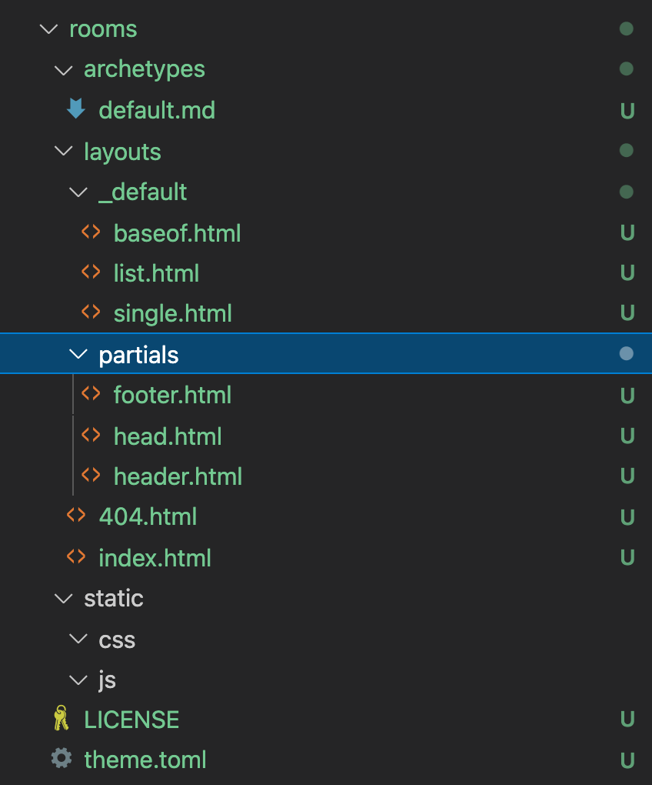

# Creating a new theme

Running a handy command provided by hugo creates all the scaffolding needed for a custom theme.

```cmd
hugo new theme rooms
```



https://www.w3schools.com/html/default.asp

## Creating a dev environment

vscode
Live Server

## Creating a footer

I want to start with a footer.

The current footer looks like this:


Create an `index.html` file.
